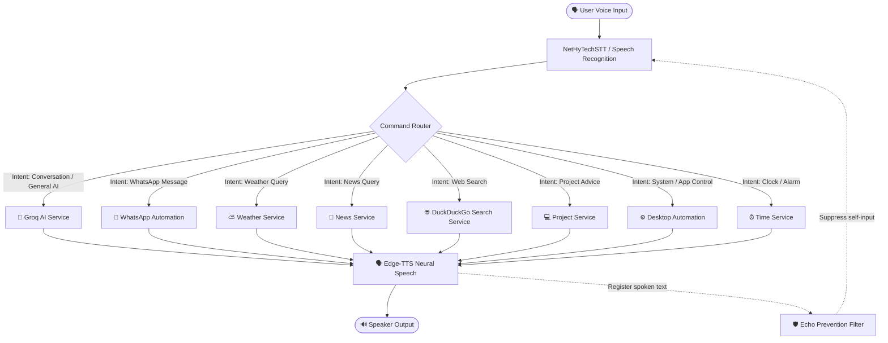

# 🤖 J.A.R.V.I.S: Personal Voice-Controlled AI Assistant

> An intelligent, voice-activated desktop AI assistant developed by **Mohith** in Python. Powered by **Groq LLM neural reasoning**, **Edge-TTS**, **real-time DuckDuckGo web search**, **WhatsApp voice automation**, and a sleek **PyQt5 Iron-Man animated HUD**.

[](https://www.python.org/)
[](https://groq.com/)
[](https://github.com/rany2/edge-tts)
[](https://riverbankcomputing.com/software/pyqt/)
[](LICENSE)
[](https://github.com/mohithraj198-pixel/My-personal-jarvis/stargazers)
[](https://github.com/mohithraj198-pixel/My-personal-jarvis/network/members)


---

## 🌟 Overview

**J.A.R.V.I.S (Just A Rather Very Intelligent System)** is a next-generation personal desktop voice assistant built by **Mohith**, inspired by Tony Stark's iconic artificial intelligence. Speak naturally to Jarvis, and it will understand your intent, retrieve live web data, control your computer, send WhatsApp messages, check weather forecasts, and reply with ultra-fast neural speech.

The assistant combines high-speed inference from **Groq** (`openai/gpt-oss-120b`), an intelligent command router, live web scrapers, and local desktop automation into a seamless hands-free experience.

---

## ✨ Features & Capabilities

| Feature | Description |
|---|---|
| 🧠 **Groq Conversational AI** | Multi-turn conversational reasoning powered by Groq LLMs with smart voice-tailored answers and context memory. |
| ⚡ **Intelligent Command Router** | Zero-latency intent classifier that routes queries to specialized services (system, web, weather, news, AI). |
| 🎙️ **Continuous Speech Recognition** | Real-time speech-to-text with self-echo cancellation so Jarvis never talks to itself. |
| 🗣️ **Neural Text-to-Speech** | Ultra-natural, human-like voice synthesis using Microsoft Edge Neural TTS with instant playback. |
| 💬 **WhatsApp Automation** | Complete hands-free messaging on WhatsApp Desktop/Web with smart contact detection and interactive voice follow-up. |
| ⛅ **Live Weather & Rain Forecasting** | Real-time temperature, precipitation probability, and wind metrics for any city with configurable default city. |
| 📰 **Live News Headlines** | Instant top news aggregation by topic or category using DuckDuckGo search without API rate limits. |
| 🌐 **Keyless Web Search** | Live Internet intelligence that summarizes search results directly into concise spoken answers. |
| 💻 **Project & Tech Advisor** | Interactive technical assistant providing coding guidance, project planning, and debugging tips. |
| ⚙️ **Desktop & System Automation** | App launcher (Edge, Chrome, WhatsApp, Notepad), system volume adjustment, and brightness controls. |
| 🎨 **Animated PyQt5 HUD** | Holographic Iron-Man arc reactor visualizer with real-time status feedback. |

---

## 🏗️ Architecture & Workflow



---

## 🚀 Getting Started

### Prerequisites

- **Python 3.10** or newer
- Working **Microphone** and **Speakers / Headphones**
- **Windows 10 / 11** (recommended for full automation features)
- **Google Chrome** or **Microsoft Edge** installed

---

### Installation

1. **Clone the repository:**
   ```bash
   git clone https://github.com/mohithraj198-pixel/My-personal-jarvis.git
   cd My-personal-jarvis
   ```

2. **Create and activate a virtual environment:**
   ```bash
   python -m venv venv
   .\venv\Scripts\activate
   ```

3. **Install dependencies:**
   ```bash
   pip install -r requirements.txt
   ```

4. **Configure environment variables:**
   Copy the example environment file and add your credentials:
   ```bash
   copy .env.example .env
   ```

   Edit `.env` with your settings:
   ```env
   # Groq Cloud API Key (Get a free key at https://console.groq.com)
   GROQ_API_KEY=your_groq_api_key_here

   # Groq Model selection
   GROQ_MODEL=openai/gpt-oss-120b

   # Multi-turn conversation depth
   MAX_HISTORY=12

   # Default city for weather queries
   DEFAULT_CITY=Mangalore
   ```

---

## 🎯 How to Run

### Option 1: Animated Desktop HUD (Recommended)
Launches the full PyQt5 animated Iron-Man interface with live audio listening:
```bash
python ui.py
```

### Option 2: Headless / Console Mode
Runs the speech recognition and command processing directly in your terminal:
```bash
python jarvis.py
```

### Option 3: Automated Verification Suite
Run the comprehensive test suite to verify all subsystem integrations:
```bash
python test_groq_jarvis.py
```

---

## 🗣️ Voice Commands & Query Examples

| Category | Example Commands |
|---|---|
| **Conversational AI** | *"Explain quantum computing in simple terms"*<br>*"Tell me a short joke"*<br>*"Who is Elon Musk?"* ➡️ *"What companies does he own?"* |
| **WhatsApp Automation** | *"Open WhatsApp and send message to Rahul that I will be late"*<br>*"Send hi to Kaushik on WhatsApp"*<br>*"Send a message to Mom"* *(Jarvis prompts: "What message would you like to send?")* |
| **Weather & Climate** | *"What's the weather today?"*<br>*"Will it rain tomorrow in Bangalore?"*<br>*"What is the temperature in Mumbai?"* |
| **Web Search** | *"Search for trending artificial intelligence projects in 2026"*<br>*"Search web for latest NASA discoveries"* |
| **News & Headlines** | *"What's happening in the news today?"*<br>*"Give me tech news headlines"* |
| **System Automation** | *"Open Microsoft Edge"*<br>*"Open Chrome"*<br>*"Open WhatsApp"*<br>*"Increase the volume"* |
| **Time & Planning** | *"What is the time right now?"*<br>*"Set an alarm for 7:00 AM"* |
| **Project Guidance** | *"How do I structure a full-stack Python application?"*<br>*"Help me debug an async API issue"* |

---

## 📁 Project Structure

```
My-personal-jarvis/
├── jarvis.py               # Main background daemon & thread lifecycle
├── ui.py                   # PyQt5 animated Iron-Man visual interface
├── co_brain.py             # Input polling loop & automation dispatcher
├── command_router.py       # High-performance natural language intent router
├── groq_service.py         # Groq LLM integration with multi-turn memory
├── news_service.py         # Live news headlines via DuckDuckGo Search (DDGS)
├── search_service.py       # Keyless live web search and summarization
├── weather_service.py      # Real-time weather, rain, and temperature service
├── project_service.py      # Multi-turn developer & project knowledge advisor
├── time_service.py         # Clock, time, and scheduling service
├── test_groq_jarvis.py     # Verification suite for all Jarvis subsystems
├── requirements.txt        # Python package dependencies
├── .env.example            # Sample configuration template
├── Automation/             # OS automation, app launching & volume controls
├── Brain/                  # Conversational intelligence & chat memory
├── NetHyTechSTT/           # Real-time speech-to-text listener
├── TextToSpeech/           # Microsoft Edge Neural TTS audio generator
├── Vision/                 # Computer vision & camera capture tools
├── TextToImage/            # AI image generation subsystem
└── Whatsapp_automation/    # Native WhatsApp desktop automation engine
```

---

## 🛠️ Tech Stack

- **Core & Runtime:** Python 3.10+
- **LLM Engine:** Groq Cloud SDK (`openai/gpt-oss-120b`, Llama 3)
- **Speech Recognition:** NetHyTechSTT / PyAudio / Web Speech
- **Voice Synthesis:** Microsoft Edge Neural TTS (`edge-tts`), Pygame Audio
- **Desktop Interface:** PyQt5 with animated GIF HUD
- **Web Intelligence:** DuckDuckGo Search (`ddgs`), Requests, BeautifulSoup4
- **System Automation:** PyAutoGUI, Selenium WebDriver, PyWhatKit, Pycaw

---

## 🛡️ Reliability & Echo Prevention

A common issue in voice assistants is **acoustic echo loop** (the assistant hearing its own voice through the microphone and answering itself). J.A.R.V.I.S implements a two-tier defense:
1. **Echo Cancellation Filter:** Spoken responses are logged into an active buffer; the speech listener automatically detects and discards any input matching the assistant's own speech.
2. **De-duplication Tracking:** Recent commands within short time windows are de-duplicated to prevent repeated execution of identical commands.

---

## 🤝 Contributing

Contributions, issues, and feature requests are welcome!
Feel free to check the [issues page](https://github.com/mohithraj198-pixel/My-personal-jarvis/issues).

1. Fork the Project
2. Create your Feature Branch (`git checkout -b feature/AmazingFeature`)
3. Commit your Changes (`git commit -m 'Add some AmazingFeature'`)
4. Push to the Branch (`git push origin feature/AmazingFeature`)
5. Open a Pull Request

---

## 👤 Author

Developed with ❤️ by **Mohith**

- **GitHub:** [@mohithraj198-pixel](https://github.com/mohithraj198-pixel)
- **Repository:** [My-personal-jarvis](https://github.com/mohithraj198-pixel/My-personal-jarvis)

---

## 📄 License

This project is licensed under the [MIT License](LICENSE).
